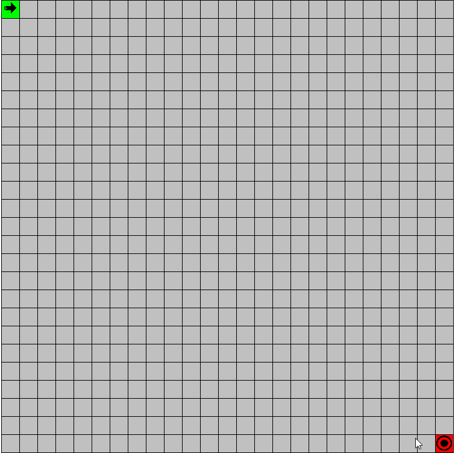
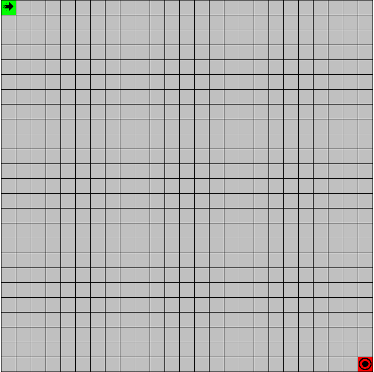

# Pathfinding-Visualizer
An app built with Qt  to visualize Dijkstra's Algorithm.

You can use this app to understand how search algorithms work. I'm gonna add more algorithms soon.

You can slide your mouse clicking to mark boxes on the table such that the path will not go through that boxes. Basically you create walls on that box so it is imposible to go through them.

You can move the start and the finish with drag and drop very easy.

You can reset the board to clear the walls and put start and finish to initial positions.

I try to fix some bugs right now which are related to clicking and changing the colour of a wall.

